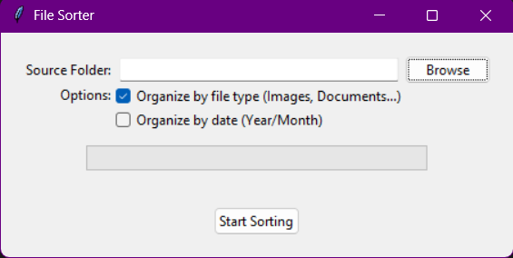

# File Sorter GUI

A simple desktop application built with Python and Tkinter to help you clean up and organize your folders. This tool sorts files into organized subdirectories based on their type (e.g., Images, Documents) and optionally by date (Year/Month). It's perfect for tidying up cluttered folders like your "Downloads" directory.

## Screenshot


## Featuresensho

-   **Easy-to-Use Interface**: A clean and simple GUI for selecting folders and options.
-   **Sort by Type**: Automatically groups files into categories like `Images`, `Documents`, `Videos`, `Music`, `Archives`, and `Other`.
-   **Sort by Extension**: If sorting by type is disabled, it will sort files into folders named after their file extension (e.g., `PDF`, `JPG`).
-   **Sort by Date**: Optionally create `Year` and `Month` subfolders for more granular organization based on the file's modification date.
-   **Real-time Progress**: A progress bar and status label show the sorting progress, which is helpful for large folders.
-   **No External Libraries**: Runs using standard Python libraries, making it lightweight and easy to run anywhere Python is installed.

## Requirements

-   **Python 3.x**

The script uses built-in Python libraries (`os`, `shutil`, `tkinter`). Tkinter is usually included with Python installations, but on some Linux distributions, you may need to install it separately:
```bash
sudo apt-get install python3-tk